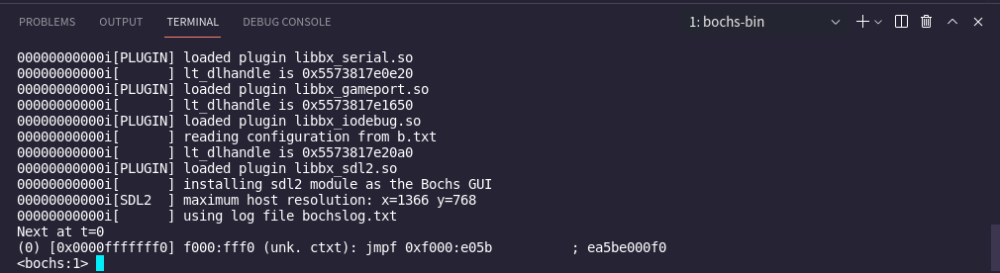
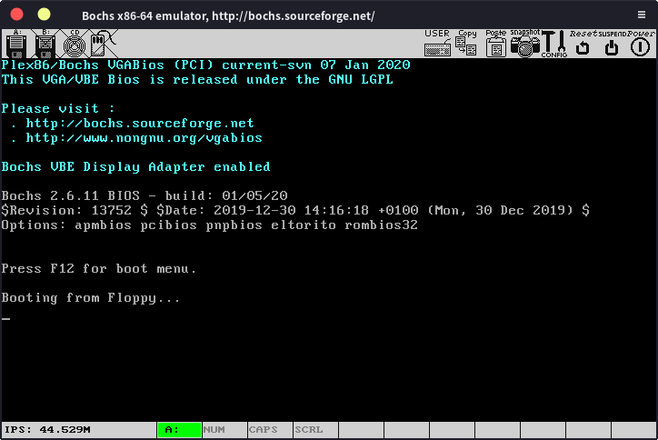

# 加载操作系统

在学完计算机组成原理以后，我们会发现计算机的工作过程非常简单，cpu从内存中取出一条指令，执行，再取下一条指令。如果我们想要让计算机做些什么，只需要将相应的程序放到内存中，然后将ip设置为程序的入口就行，所有的程序，包括操作系统都只是一堆指令而已，cpu运行它们的方法都是一样的。同样的，如果没有程序，我们的计算机就什么都做不了。那么刚开机的时候我们的计算机有什么程序可以用呢？刚开机的时候RAM还是空的，所有的程序都在硬盘上，如果我们想要把程序从硬盘写到RAM上，就需要一个能读取硬盘的程序，可RAM里面还没有程序......这就陷入了一个“先有鸡还是现有蛋”的问题。

想要打破这个死循环，我们就要有一个在计算机启动后可以直接运行的程序，这就是BIOS，它被放在ROM里面。这样计算机刚启动的时候就有程序可以运行了。（当然，BIOS也是老黄历了，不过我们这里大概了解一下就行）

考虑到硬盘中可能有多个操作系统，还可能从不同的地方加载（比如U盘），处理起来比较麻烦，所以为了让BIOS保持简单，我们把引导操作系统的任务交给另一个程序：bootloader。它被放在硬盘最开始的512字节处（这个区域也叫引导扇区）。BIOS加载bootloader，然后由bootloader引导操作系统。当然，有的时候bootloader可能还是不太够用（毕竟只有512字节），这时我们会把bootloader分成两个部分，第一个部分加载第二个部分，第二个部分没有512字节的限制，可以实现更多功能，我们就可以让更加“强大”的第二个部分来引导操作系统。

于是从计算机启动到我们的操作系统开始运行的流程就清楚了：计算机会先执行BIOS，然后BIOS会将bootloader，也就是引导程序从硬盘的引导扇区读取到内存中，bootloader引导我们的操作系统，当操作系统的代码被放进内存后，bootloader就会跳转到操作系统的入口处，我们的操作系统就正式开始运行了。

在x86计算机上，我们打开计算机后，cpu处于实模式，cs寄存器的内容为0xFFFF，ip寄存器的内容为0x0000，实模式的寻址方式为CS:IP（cs左移4位再加上ip），所以计算机会首先从0xFFFF0（ROM BIOS映射区）寻址，执行BIOS程序，BIOS会先进行一些简单的硬件检测工作，确保计算机硬件正常，然后BIOS会将硬盘最开始的512字节的内容读入到内存0x7c00处，然后设置cs为0x07c0，ip为0x0000，开始执行引导程序。

我们可以先编写一个简单的引导程序，当然，现在你在这512字节的程序中随便写什么东西都行，只要他是一个正确的程序，只有512字节大，同时以0xaa55作为结尾（表示这确实是个引导程序）。

随便打开一个16进制编辑器，写入以下内容（注意一共有512字节）

    EB FE 00 00 00 00 00 00 00 00 00 00 00 00 00 00 00 00 00 00 00 00 00
    00 00 00 00 00 00 00 00 00 00 00 00 00 00 00 00 00 00 00 00 00 00 00
    ..........00 00 00 55 AA

由于x86使用小端序，所以结尾为55aa。然后保存为bootsect.bin。

或者也可以创建一个汇编文件bootsect.asm，写入以下程序：

```assembly
loop:
jmp loop 
times 510-($-$$) db 0
dw 0xaa55 
```

然后使用nasm:

    nasm -f bin bootsect.asm -o bootsect.bin

就可以得到一个名为bootsect.bin的文件，这与上面的那个bootsect.bin是等价的。

现在，我们就有了一个最简单的引导程序，我们创建一个bochs的配置文件b.txt，写入以下内容：

    floppya: 1_44=bootsect.bin , status=inserted
    boot: a
    megs:       32
    display_library: sdl2
    romimage:     file=/usr/share/bochs/BIOS-bochs-latest
    vgaromimage:   file=/usr/share/bochs/VGABIOS-lgpl-latest】
    log:       bochslog.txt
    clock:      sync=realtime, time0=local
    cpu:       count=1, ips=1000000

然后执行：

    bochs -f b.txt -q

就可以看到

 

输入c后回车，就看到了我们这个引导程序的运行结果：

 

只有一行”Booting from Floppy”，毕竟就是个无限循环吗。

如果我们要从这个部分开始工作，一步一步完善这个引导程序，那可就太麻烦了，我们要做的是操作系统，不是bootloader，大致了解一下就行，在这上面花费太多的时间还是有点不值得的。幸好，我们可以使用现成的GRUB跳过这一部分，后面我们会提到。
