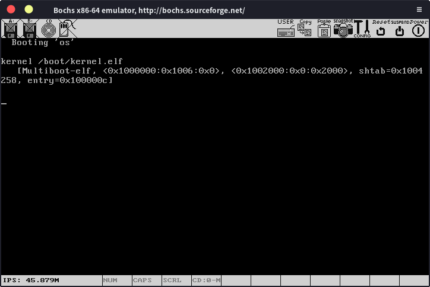

#  使用C语言

在上一节中我们写了一个简单的“操作系统”，后面就要逐步开始实现各种功能了，但我们显然不能全都用汇编来写，所以在这里介绍一下使用汇编调用c语言，首先改一下loader.s：

```assembly
extern kmain
global loader                   ; the entry symbol for ELF

MAGIC_NUMBER equ 0x1BADB002     ; magic number
FLAGS        equ 0x0            ; multiboot flags
CHECKSUM     equ -MAGIC_NUMBER  ; checksum

KERNEL_STACK_SIZE equ 8192      ; size of stack

section .__mbHeader
align 0x4
    dd MAGIC_NUMBER             ; write the magic number to the machine code,
    dd FLAGS                    ; the flags,
    dd CHECKSUM                 ; and the checksum

section .bss
align 4                         ; align at 4 bytes
kernel_stack:
    resb KERNEL_STACK_SIZE      ; reserve stack for the kernel

section .text:
align 4

loader:
    call kmain

.loop:
    jmp .loop
```

就是在文件开始的地方加一句extern kmain，声明了一个外部符号，跟c语言中声明函数差不多，然后在loader中调用kmain，kmain这个函数将使用c语言实现。

在kernel文件夹下创建main.c文件，写入代码：

```c
void kmain()
{
    return;
}
```

很简单，就是定义了kmain函数。这部分还是很容易理解的，GRUB引导我们的操作系统后，跳转到loader函数，然后loader函数调用我们使用c语言定义的kmain函数，我们后面代码就可以写在kmain里面，或者再用c语言写其他的功能，然后用kmain调用，我们就可以彻底摆脱汇编了（其实没有）。

现在来看一下实际运行的效果，进入kernel文件夹，先编译loader.s：

    nasm loader.s -f elf -o loader.o   

然后编译mian.c：

    i386-elf-gcc -g -m32 -ffreestanding -c -std=c11 main.c -o main.o   

返回上一级目录，生成kernel.elf：

    i386-elf-ld -T link.ld -melf_i386 kernel/loader.o kernel/main.o -o kernel.elf   

将kernel.elf放入到iso/boot文件夹中，生成iso文件：

    genisoimage -R                              \
                -b boot/grub/stage2_eltorito    \
                -no-emul-boot                   \
                -boot-load-size 4               \
                -A os                           \
                -input-charset utf8             \
                -quiet                          \
                -boot-info-table                \
                -o os.iso                       \
                iso

然后使用bochs运行我们的操作系统，可以看到：



一切正常！

下一步，我们将尝试在屏幕上输出点东西，实现操作系统开发中的"Hello World"。