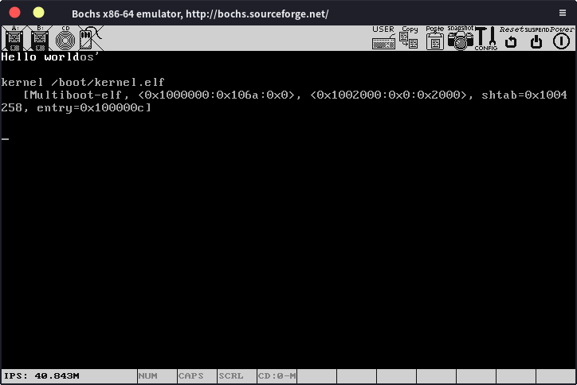

# Hello World

上一节中我们为了得到os.iso在终端写了一大堆命令，还要移动文件，如果我们每次写点代码就要跑这一大段流程才能看到结果就实在是太可怕了。还好，我们可以使用Makefile来帮我们自动完成这些工作，如果你之前没使用过Makefile，那么现在是时候去了解一下了。

我们的Makefile将会写成下面这样：

```makefile
C_SOURCES = $(wildcard kernel/*.c)
CFLAGS = -g -m32 -ffreestanding -c -std=c11

OBJ = ${C_SOURCES:.c=.o}

LDFLAGS = -T link.ld -melf_i386

CC = i386-elf-gcc

os.iso: kernel.elf
    cp kernel.elf iso/boot/kernel.elf
    genisoimage -R                              \
                -b boot/grub/stage2_eltorito    \
                -no-emul-boot                   \
                -boot-load-size 4               \
                -A os                           \
                -input-charset utf8             \
                -quiet                          \
                -boot-info-table                \
                -o os.iso                       \
                iso

kernel.elf: kernel/loader.o ${OBJ}
    i386-elf-ld $(LDFLAGS) $^ -o kernel.elf

run: os.iso
    bochs -f bch.txt -q

%.o: %.c
    ${CC} ${CFLAGS} $< -o $@

%.o: %.s
    nasm $< -f elf -o $@

clean:
    rm -rf *.elf
    rm -rf kernel/*.o
```

我们之前创建文件夹的时候就创建了Makefile，现在只要将这些写进去就行，现在我们只需要一句make run就可以完成编译代码，链接程序，生成镜像文件，bochs运行镜像文件等一大堆事。通过make clean就可以清理.o文件和.elf文件。

开始正题，我们已经成功用汇编调用了c函数，现在，我们想看到一些实际的效果，其中最直接且最简单的应该就是在屏幕上输出一些内容了，要做到这个非常简单，内存上有一块从地址0xb8000处开始的vga彩色文本显存映射区，如果我们想要显示任何字符，直接写在这片内存上就行。因为是“彩色文本”，所以我们每写一个字符就要写两个字节，第一个字节是字符本身，第二个字节是显示的文本颜色，最简单的就是0x0f，即黑底白字，看一下代码：

```c
void kmain()
{
    char *screen = 0xb8000;
    int offset = 0;
    char *str = "Hello world";
    for(int i = 0;i < 22;i += 2)
    {
        screen[i] = str[i / 2];
        screen[i + 1] = 0x0f;
    }
    return;
}
```

其中字符指针screen指向内存地址0xb8000，然后通过一个for循环依次输出str字符串中的内容，在这里可以看到我们每次都是写两个字节，正如我们上面所说的，第一个字节为文本本身，第二个字节是要显示的颜色。注意，我们是在写操作系统，所有的东西都要自己写，连c语言标准库都没有，所以我们这里也没法用strlen。

终端运行make run，可以看到运行结果



我们成功打印出了Hello world！也可以把颜色改成0x04，也就是黑底红字


现在我们成功输出了hello world，下一步，就是在这个基础上完善，实现printf()函数，我们就可以方便快捷的在屏幕上输出任何字符串了。

