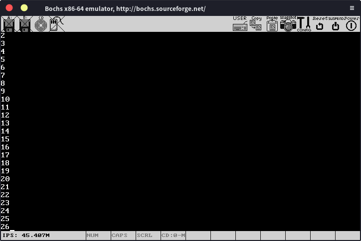

# 屏幕滚动

我们之前在写屏幕输出部分的时候没有考虑输出的字符数量大于25 * 80时的问题，这个时候我们就要将屏幕“向上滚动”。处理方法也非常简单：将屏幕第二行到最后一行的内容复制到第一行到倒数第二行，清空最后一行。光标设置为最后一行的开始处。

我们首先在libc下新建memory.c，里面写入代码：

```c
#include "../include/type.h"

void memcpy(void *src, void *dest,uint32_t len)
{
    uint8_t *s = (uint8_t*)src;
    uint8_t *d = (uint8_t*)dest;
    for(uint32_t i = 0;i < len;i++){
        d[i] = s[i];
    }
}

void *memset(void *src,uint8_t val,uint32_t len)
{
    uint8_t *s = (uint8_t*)src;
    for(uint32_t i = 0;i < len;i++){
        s[i] = val;
    }
    return src;
}
```

这样我们就有了复制和清除内存的函数。

然后更改putChar函数：

```c
void putChar(char character, int row,int col, char attr)
{
    unsigned char* screen = (unsigned char*)VIDEO_ADDRESS;
    if(!attr)attr = WHITE_ON_BLACK;
    if(col >= MAX_COLS || row >= MAX_ROWS){
        int pos = MAX_COLS * MAX_ROWS * 2;
        screen[pos - 2] = 'E';
        screen[pos - 1] = RED_ON_WHITE;
        return;
    }

    int offset;
    if(col < 0 && row < 0){//直接在当前光标处输出
        offset = getCursorOffset();
    }
    else{//否则输出到指定位置
        offset = getOffset(row,col);
    }

    if(character == '\n'){//换行符处理
        row = getCurrentRow(offset);
        offset = getOffset(row + 1,0);
    }
    else{
        screen[offset] = character;
        screen[offset + 1] = attr;
        offset += 2;
    }

    if(offset >= MAX_COLS * MAX_ROWS * 2){
        offset = screenScrolling(offset);
    }

    setCursorOffset(offset);
}
```

就是在最后加上了一个处理屏幕滚动的if语句，最后实现屏幕滚动的函数：

```c
int screenScrolling(int curOffset)
{
    memcpy(
        (void*)(VIDEO_ADDRESS + getOffset(1,0)),
        (void*)(VIDEO_ADDRESS),
        MAX_COLS * (MAX_ROWS - 1) * 2
    );
    uint8_t *pos = (uint8_t*)(getOffset(MAX_ROWS - 1,0) + VIDEO_ADDRESS);
    for(int i = 0;i < MAX_COLS;i++){
        pos[i * 2] = ' ';
        pos[i * 2 + 1] = WHITE_ON_BLACK;
    }
    curOffset -= MAX_COLS * 2;
    return curOffset;
}
```

整理好头文件，这部分就算完成了。我们可以简单测试一下

```c
void kmain()
{
    clearScreen();
    char *str = "Lisp";
    int a = 1200;
    // kprintf("Hello,%s,num=%d",str,a);
    kprintf("1\n2\n3\n4\n5\n6\n7\n8\n9\n10\n11\n12\n13\n14\n15\n16\n17\n18\n19\n20\n21\n22\n23\n24\n25\n26");
    return;
}
```

结果：


