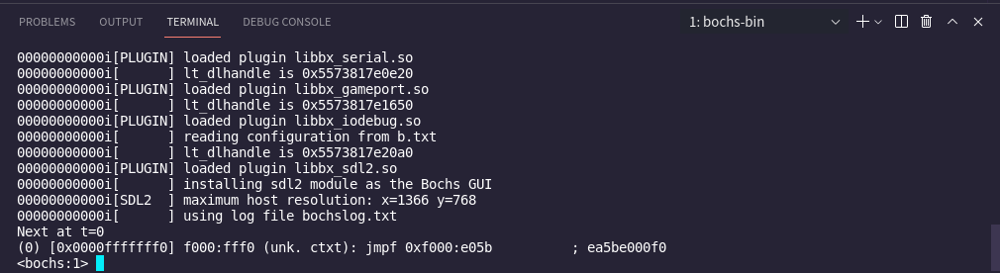

# boot-sect

在学完计算机组成原理以后，我们会发现计算机的工作过程非常简单，cpu从内存中取出一条指令，执行，再取下一条指令（当然，前一条指令执行完以前就会取下一条指令）

在x86计算机上，我们打开计算机后，cpu处于实模式，cs寄存器的内容为0xFFFF，ip寄存器的内容为0x0000，实模式的寻址方式为CS:IP（cs左移4位再加上ip），所以计算机会首先从0xFFFF0（ROM BIOS映射区）寻址，执行BIOS程序，BIOS会先进行一些简单的硬件检测工作，确保计算机硬件正常，然后BIOS会将硬盘最开始的512字节（又被称为引导扇区）的内容读入到内存0x7c00处，然后设置cs为0x07c0，ip为0x0000，计算机就从0x7c00开始执行。

在这个过程中，BISO程序已经在计算机里面了，我们不用关心，我们要关心的，就是引导扇区那512个字节的程序，这个程序只做一件事：加载我们的操作系统。

当然，现在你在这512字节的程序中随便写什么东西都行，只要他是一个正确的程序，只有512字节大，同时以0xaa55作为结尾。

我们首先写一个最简单的程序，我们可以随便打开一个16进制编辑器，写入以下内容

    EB FE 00 00 00 00 00 00 00 00 00 00 00 00 00 00 00 00 00 00 00 00 00
    00 00 00 00 00 00 00 00 00 00 00 00 00 00 00 00 00 00 00 00 00 00 00
    ..........00 00 00 55 AA

由于x86使用小端序，所以结尾为55aa。然后保存为bootsect.bin。

或者也可以创建一个汇编文件bootsect.asm，写入以下程序：

```assembly
loop:
jmp loop 
times 510-($-$$) db 0
dw 0xaa55 
```

然后使用nasm：  nasm -f bin bootsect.asm -o bootsect.bin

就可以得到一个名为bootsect.bin的文件，这与上面的那个bootsect.bin是等价的。

现在，我们就有了一个最简单的引导程序，我们创建一个bochs的配置文件b.txt，写入以下内容：

    floppya: 1_44=bootsect.bin , status=inserted
    boot: a
    megs:       32
    display_library: sdl2
    romimage:     file=/usr/share/bochs/BIOS-bochs-latest
    vgaromimage:   file=/usr/share/bochs/VGABIOS-lgpl-latest】
    log:       bochslog.txt
    clock:      sync=realtime, time0=local
    cpu:       count=1, ips=1000000

然后执行：

bochs -f b.txt -q

就可以看到

 

输入c后回车，就看到了我们这个引导程序的运行结果：

 

只有一行”Booting from Floppy”，毕竟就是个无限循环吗。

当然，我们要做的是操作系统，不是bootloader，大致了解一下就行，在这上面花费太多的时间还是有点不值得的，后面，我们会编写一个简易的操作系统内核，然后使用GRUB加载它。
