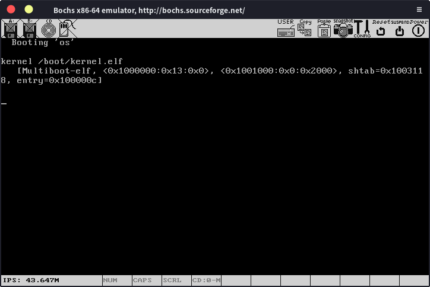

# 使用GRUB

我们使用GRUB来引导我们的操作系统，正如我们上一节所说，自己写bootloader实在是太麻烦了，使用现成的更加方便。

（这一部分极其死板，就是些前期的配置问题，不用理解。

首先创建一个文件夹，其内部结构如下：

	littleOS
	|--iso
	| |-- boot
	| | |-- grub
	| | | |-- menu.lst
	| | | |-- stage2_eltorito
	|--kernel
	| |-- loader.s
	|--bch.txt
	|--link.ld
	|--Makefile


其中menu.lst为GRUB的配置文件，写入以下内容：

    default=0
    timeout=0
    
    title os
    kernel /boot/kernel.elf

我们指定默认启动项为0（按照开机选择界面的顺序对应），进入默认启动项的等待时间为0，也就是开机直接进入开机选择界面的第一个操作系统，title就是操作系统的标题，显示在开机选择界面上，这个可以随便写，再下面一行就是操作系统程序的位置

然后配置bochs，在bch.txt中写入如下内容：

    megs:       32
    display_library: sdl2
    romimage:     file=/usr/share/bochs/BIOS-bochs-latest
    vgaromimage:   file=/usr/share/bochs/VGABIOS-lgpl-latest
    ata0-master:   type=cdrom, path=os.iso, status=inserted
    boot:       cdrom
    log:       bochslog.txt
    clock:      sync=realtime, time0=local
    cpu:       count=1, ips=1000000
    magic_break: enabled = 1

现在，我们就可以编写我们的操作系统代码了，kernel文件夹下放置我们的操作系统的代码，现在只有一个最基本的loader.s，写入代码（你应该懂x86汇编语言，如果不懂的话，先学一下吧，挺简单的）：

```assembly
global loader                   ; the entry symbol for ELF

MAGIC_NUMBER equ 0x1BADB002     ; magic number
FLAGS        equ 0x0            ; multiboot flags
CHECKSUM     equ -MAGIC_NUMBER  ; checksum

KERNEL_STACK_SIZE equ 8192      ; size of stack

section .__mbHeader
align 4
    dd MAGIC_NUMBER
    dd FLAGS
    dd CHECKSUM

section .bss
align 4                         ; align at 4 bytes
kernel_stack:
    resb KERNEL_STACK_SIZE      ; reserve stack for the kernel

section .text:
align 4

loader:
    mov eax, 0xAABBCCDD

.loop:
    jmp .loop
```

可以看到我们在程序开始的地方定义了MAGIC_NUMBER，FLAGS和CHECKSUM，然后写入到了__mbHeader段，这一部分是GRUB的规定，不用理解，程序从loader函数开始执行，这里我们只做一件事，就是把0xAABBCCDD写入到eax寄存器中。现在就可以编译这段程序了，当然，我们还得先写一个链接脚本，保存到link.ld中，告诉链接器如何链接我们的程序：

    ENTRY(loader)
    OUTPUT_FORMAT(elf32-i386)
    SECTIONS {
        . = 0x01000000;
    
        .__mbHeader : {
            *(.__mbHeader)
        }
        .text ALIGN (0x1000):
        {
            *(.text)
            *(.rodata*)
        }
    
        .data ALIGN (0x1000):
        {
            *(.data)
        }
    
        .bss ALIGN (0x1000):
        {
            *(COMMON)
            *(.bss)
        }
    }

万事俱备，首先编译loader.s，进入kernel文件夹，使用nasm：

    nasm -f elf32 loader.s

就得到了loader.o文件，到上一级目录，使用链接器ld：

    ld -T link.ld -melf_i386 kernel/loader.o -o kernel.elf   

然后把得到的kernel.elf复制到iso/boot下，就是我们在menu.lst中写的位置，使用下面的命令生成镜像文件：

    genisoimage -R                              \
                -b boot/grub/stage2_eltorito    \
                -no-emul-boot                   \
                -boot-load-size 4               \
                -A os                           \
                -input-charset utf8             \
                -quiet                          \
                -boot-info-table                \
                -o os.iso                       \
                iso

我们就得到了我们这个简易操作系统的镜像文件，使用bochs来运行它：

    bochs -f bch.txt -q

然后我们就可以看到这个界面：

 

跟上次不一样了，关闭bochs后，我们可以打开bochslog文件，可以看到下面这样的信息：

    06448953000i[CPU0  ] | EAX=aabbccdd  EBX=0002cd80  ECX=00000001  EDX=00000000
    06448953000i[CPU0  ] | ESP=00067ed0  EBP=00067ee0  ESI=0002cef0  EDI=0002cef1

0xaabbcc已经成功写入到eax寄存器中了！

 

我们成功编写了一个简单的操作系统（虽然它简单的还不配被称为操作系统)，并使用GRUB引导运行了它。然后我们就可以在这个基础上逐步完善了。