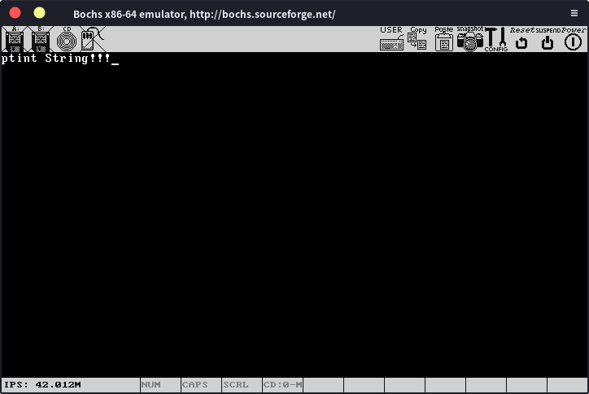

# 屏幕输出

在实现printf之前我们先处理一下屏幕输出的一些问题，上一节中我们已经知道，我们只要从内存0xb8000开始的地方直接写入字符，他就可以显示在屏幕上。在bochs上，我们可以显示25行，每行80个字符，每个字符两个字节，我们可以把这个显示的区域看作一个起始地址为0xb8000，长度为25 * 80 * 2的一维字符型数组，我们所有的在屏幕上打印字符的操作都可以看成给这个数组的某一个元素赋值的操作。现在只有一个问题，写入数组时的下标是多少，即光标的位置在那。

我们可以通过操作显卡的一些端口来获取光标的位置。

首先，我们创建一个与kernel同级的文件夹：include，用来放各种头文件，然后在里面新建一个type.h文件，来定义我们后面要用的各种数据类型，type.h内容如下：

```c
#ifndef TYPE__
#define TYPE__

typedef char bool;
#define TRUE    1
#define FALSE   0
#define OK      0
#define ERROR  -1 
#define NULL (void *)0

typedef unsigned long long uint64_t;
typedef long long int64_t;
typedef unsigned int uint32_t;
typedef int int32_t;
typedef unsigned short uint16_t;
typedef short int16_t;
typedef unsigned char uint8_t;
typedef char int8_t;

typedef	uint64_t u64;
typedef	uint32_t u32;
typedef	uint16_t u16;
typedef	uint8_t u8;

#endif
```

然后再新建一个与kernel同级的文件夹：drivers，我们各种设备驱动相关的代码都会放在里面，先新建一个asm.c，我们在这里面写各种各样的汇编相关的代码，现在只有一些端口相关的代码，端口控制可以使用汇编语言的in和out指令，我们可以使用__asm__ __volatile__ 在c语言里嵌入汇编。

```c
#include"../include/type.h"
#include"../include/asm.h"
/* 从端口读一个字节 */
inline uint8_t inb (uint16_t port){
    uint8_t result;
    __asm__ __volatile__ ("inb %1, %0" : "=a" (result) : "dN" (port));
    return result;
}

/* 向端口写一个字节 */
inline void outb (uint16_t port, uint8_t data){
    __asm__ __volatile__ ("outb %1, %0" : : "dN" (port), "a" (data));
}

/* 从端口读一个字 */
inline uint16_t inw (uint16_t port){
    uint16_t result;
    __asm__ __volatile__ ("inw %1, %0" : "=a" (result) : "dN" (port));
    return result;
}

/* 向端口写一个字 */
inline void outw (uint16_t port, uint16_t data){
    __asm__ __volatile__ ("outw %1, %0" : : "dN" (port), "a" (data));
}

```

然后把函数原型写到asm.h中，asm.h放在include文件夹下，这样我们就能在其他文件里面使用这些函数了。

```c
#ifndef ASM__
#define ASM__
#include"../include/type.h"

uint8_t inb (uint16_t port);
void outb (uint16_t port, uint8_t data);
uint16_t inw (uint16_t port);
void outw (uint16_t port, uint16_t data);

#endif
```

现在我们开始处理屏幕字符输出，在include下新建screen.h，写入以下代码：

```c
#ifndef SCR__
#define SCR__
#include"type.h"

#define VIDEO_ADDRESS 0xb8000
#define MAX_ROWS 25
#define MAX_COLS 80
#define WHITE_ON_BLACK 0x0f
#define RED_ON_WHITE 0xf4

#define REG_SCREEN_CTRL 0x3d4
#define REG_SCREEN_DATA 0x3d5

void clearScreen();
void putChar(char character, int col, int row, char attr);
void printChar(char c);

#endif
```

VIDEO_ADDRESS就是显存映射的起始地址，然后正如我们前面所说的，25行，每行80个字符，我们预先定义了两个字符颜色，一个是黑底白字，用于一般输出，一个是白底红字，用于错误信息输出，其实我们能显示的颜色还有很多，方便起见就先用这两个。再下面是我们要操作的端口，最后就是我们要实现并公开的几个函数。

在drivers下新建screen.c，先写入以下代码：

```c
#include"../include/screen.h"
#include"../include/asm.h"

int getCursorOffset()//获取当前光标位置
{
    outb(REG_SCREEN_CTRL, 14);
    int offset = inb(REG_SCREEN_DATA) << 8;
    outb(REG_SCREEN_CTRL, 15);
    offset += inb(REG_SCREEN_DATA);
    return offset * 2; 
}

void setCursorOffset(int offset)//设置光标位置
{
    offset /= 2;
    outb(REG_SCREEN_CTRL, 14);
    outb(REG_SCREEN_DATA, (unsigned char)(offset >> 8));
    outb(REG_SCREEN_CTRL, 15);
    outb(REG_SCREEN_DATA, (unsigned char)(offset & 0xff));
}
```
这些不理解也没关系，只是些端口操作的代码，也没什么可以理解的，下面的部分才是重点。

我们有了获取和设置光标位置的函数，但是现在有一个问题，我们获得和设置的光标位置是一维数组下标的形式，但屏幕是二维的，使用二维坐标更符合我们的习惯，所以我们要转换一下：

```c
int getOffset(int row, int col)
{
    return (row * MAX_COLS + col) * 2;
}

int getCurrentRow(int offset)
{
    return offset / (2 * MAX_COLS);
}

int getCurrentCol(int offset)
{
    return (offset - getCurrentRow(offset) * 2 * MAX_COLS) / 2;
}
```

先实现最简单的清屏功能，即clearScreen()函数：

```c
void clearScreen()
{
    int screenSize = MAX_COLS * MAX_ROWS;
    unsigned char* mem = (unsigned char*)VIDEO_ADDRESS;
    for(int i = 0;i < screenSize;i++){
        mem[i * 2] = ' ';
        mem[i * 2 + 1] = WHITE_ON_BLACK;
    }
    setCursorOffset(getOffset(0,0));
}
```

十分简单，我们只要遍历整个“数组”，把每个位置的字符变成空格，颜色设置为黑底就行，最后再把光标设置到开始的地方。

然后就是将字符输出到屏幕的指定位置，即putChar()函数：

```c
void putChar(char character, int row,int col, char attr)
{
    unsigned char* screen = (unsigned char*)VIDEO_ADDRESS;
    if(!attr)attr = WHITE_ON_BLACK;//默认黑底白字
    if(col >= MAX_COLS || row >= MAX_ROWS){//越界，报错
        int pos = MAX_COLS * MAX_ROWS * 2;
        screen[pos - 2] = 'E';
        screen[pos - 1] = RED_ON_WHITE;
        return;
    }

    int offset;
    if(col < 0 && row < 0){//直接在当前光标处输出
        offset = getCursorOffset();//获取当前光标位置
    }
    else{//否则输出到指定位置
        offset = getOffset(row,col);
    }

    if(character == '\n'){//换行符处理
        row = getCurrentRow(offset);
        offset = getOffset(row + 1,0);
    }
    else{
        screen[offset] = character;
        screen[offset + 1] = attr;
        offset += 2;
    }

    setCursorOffset(offset);//设置新的光标位置
}
```

当输出位置的行和列都小于0时，即col或者row小于0时，我们直接将字符输出在当前光标处，否则就输出在指定位置。输出字符后重新设置光标位置。

然后实现printChar，也就是在当前光标处直接输出一个字符，这个可以通过我们刚写的putChar实现

```c
void printChar(char c)
{
    putChar(c,-1,-1,0);
}
```

现在，我们就有了实现printf所需的全部功能，可以先写一个printString测试一下，确保这些代码能够正常工作。

```c
void printString(char *str)
{
    for(;*str != '\0';str++)
        printChar(*str);
}
```

注意把函数原型放到screen.h中，现在我们就能在kmain中通过printString输出字符串了

```c
#include"../include/screen.h"

void kmain()
{
    clearScreen();
    printString("ptint String!!!");
    return;
}
```

我们现在多了一堆文件夹和一堆文件，所以Makefile也要该一下，把第一行的

```makefile
C_SOURCES = $(wildcard kernel/*.c)
```

改成：

```makefile
C_SOURCES = $(wildcard kernel/*.c drivers/*.c)
```

最后的clean改成：

```makefile
clean:
    rm -rf *.elf
    rm -rf kernel/*.o drivers/*.o
```

然后我们就可以查看运行效果了：



一切正常！

下面，我们就可以实现printf了。

