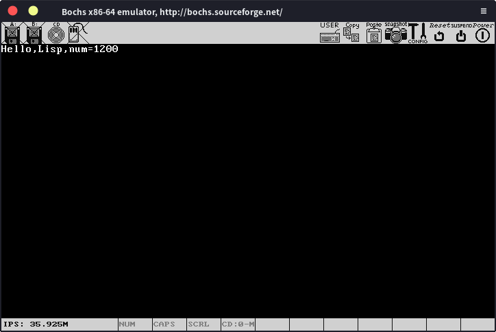

# printf

我们现在开始实现printf函数，函数原型如下（前面加了个k，表示这是内核的打印函数）：

```c
void kprintf(char *fmt, ...);
```

现在有一个问题，即printf的参数数量是不定的，这种情况怎么处理？

这就要先说明一下c语言参数的传递方式了，c语言有一个基本的调用约定：函数调用时参数从右到左依次入栈，被调用的函数通过指针的形式使用参数，当调用结束后，调用者再销毁参数（注意被调用的函数不能销毁参数），比如：

```c
void func1()
{
	int a = 1,b = 2;
	func2(a,b);
}
```

在这个例子中，当func1要调用func2时，会从右到左依次将参数压栈，也就是b先入栈，然后a入栈，然后调用func2。当func2执行完毕，返回到func1后，func1再通过pop将参数销毁。

怎么在语法上表示参数数量不定呢？c语言使用...表示可变参数，正如我们一开始写的kprintf的原型那样。

有了表示可变参数的语法，同时我们也了解了c语言传递参数的方式，现在我们大概就能想到处理可变参数问题的方法了。无论他有多少个参数，最后都是压进栈里面吗，我们直接用指针访问栈获取参数不就行了？

嗯，确实可以这么做，但还是太麻烦了，我们有更直接的方法，编译器已经将上面这种操作封装好了，我们直接用就行。首先将以下代码保存为stdarg.h，头文件统一放在include文件夹下。

```c
/* Copyright (C) 1989-2019 Free Software Foundation, Inc.

This file is part of GCC.

GCC is free software; you can redistribute it and/or modify
it under the terms of the GNU General Public License as published by
the Free Software Foundation; either version 3, or (at your option)
any later version.

GCC is distributed in the hope that it will be useful,
but WITHOUT ANY WARRANTY; without even the implied warranty of
MERCHANTABILITY or FITNESS FOR A PARTICULAR PURPOSE.  See the
GNU General Public License for more details.

Under Section 7 of GPL version 3, you are granted additional
permissions described in the GCC Runtime Library Exception, version
3.1, as published by the Free Software Foundation.

You should have received a copy of the GNU General Public License and
a copy of the GCC Runtime Library Exception along with this program;
see the files COPYING3 and COPYING.RUNTIME respectively.  If not, see
<http://www.gnu.org/licenses/>.  */

/*
 * ISO C Standard:  7.15  Variable arguments  <stdarg.h>
 */

#ifndef _STDARG_H
#ifndef _ANSI_STDARG_H_
#ifndef __need___va_list
#define _STDARG_H
#define _ANSI_STDARG_H_
#endif /* not __need___va_list */
#undef __need___va_list

/* Define __gnuc_va_list.  */

#ifndef __GNUC_VA_LIST
#define __GNUC_VA_LIST
typedef __builtin_va_list __gnuc_va_list;
#endif

/* Define the standard macros for the user,
   if this invocation was from the user program.  */
#ifdef _STDARG_H

#define va_start(v,l)	__builtin_va_start(v,l)
#define va_end(v)	__builtin_va_end(v)
#define va_arg(v,l)	__builtin_va_arg(v,l)
#if !defined(__STRICT_ANSI__) || __STDC_VERSION__ + 0 >= 199900L \
    || __cplusplus + 0 >= 201103L
#define va_copy(d,s)	__builtin_va_copy(d,s)
#endif
#define __va_copy(d,s)	__builtin_va_copy(d,s)

/* Define va_list, if desired, from __gnuc_va_list. */
/* We deliberately do not define va_list when called from
   stdio.h, because ANSI C says that stdio.h is not supposed to define
   va_list.  stdio.h needs to have access to that data type, 
   but must not use that name.  It should use the name __gnuc_va_list,
   which is safe because it is reserved for the implementation.  */

#ifdef _BSD_VA_LIST
#undef _BSD_VA_LIST
#endif

#if defined(__svr4__) || (defined(_SCO_DS) && !defined(__VA_LIST))
/* SVR4.2 uses _VA_LIST for an internal alias for va_list,
   so we must avoid testing it and setting it here.
   SVR4 uses _VA_LIST as a flag in stdarg.h, but we should
   have no conflict with that.  */
#ifndef _VA_LIST_
#define _VA_LIST_
#ifdef __i860__
#ifndef _VA_LIST
#define _VA_LIST va_list
#endif
#endif /* __i860__ */
typedef __gnuc_va_list va_list;
#ifdef _SCO_DS
#define __VA_LIST
#endif
#endif /* _VA_LIST_ */
#else /* not __svr4__ || _SCO_DS */

/* The macro _VA_LIST_ is the same thing used by this file in Ultrix.
   But on BSD NET2 we must not test or define or undef it.
   (Note that the comments in NET 2's ansi.h
   are incorrect for _VA_LIST_--see stdio.h!)  */
#if !defined (_VA_LIST_) || defined (__BSD_NET2__) || defined (____386BSD____) || defined (__bsdi__) || defined (__sequent__) || defined (__FreeBSD__) || defined(WINNT)
/* The macro _VA_LIST_DEFINED is used in Windows NT 3.5  */
#ifndef _VA_LIST_DEFINED
/* The macro _VA_LIST is used in SCO Unix 3.2.  */
#ifndef _VA_LIST
/* The macro _VA_LIST_T_H is used in the Bull dpx2  */
#ifndef _VA_LIST_T_H
/* The macro __va_list__ is used by BeOS.  */
#ifndef __va_list__
typedef __gnuc_va_list va_list;
#endif /* not __va_list__ */
#endif /* not _VA_LIST_T_H */
#endif /* not _VA_LIST */
#endif /* not _VA_LIST_DEFINED */
#if !(defined (__BSD_NET2__) || defined (____386BSD____) || defined (__bsdi__) || defined (__sequent__) || defined (__FreeBSD__))
#define _VA_LIST_
#endif
#ifndef _VA_LIST
#define _VA_LIST
#endif
#ifndef _VA_LIST_DEFINED
#define _VA_LIST_DEFINED
#endif
#ifndef _VA_LIST_T_H
#define _VA_LIST_T_H
#endif
#ifndef __va_list__
#define __va_list__
#endif

#endif /* not _VA_LIST_, except on certain systems */

#endif /* not __svr4__ */

#endif /* _STDARG_H */

#endif /* not _ANSI_STDARG_H_ */
#endif /* not _STDARG_H */
```

虽然有一大堆，看起来很可怕，但我们真正要用的也就是va_list，va_start，va_arg和va_end而已。

我们可以通过va_list定义一个变量，这个变量就是参数的指针，然后通过va_start获取第一个参数的地址，来初始化va_list变量。va_arg可以让va_list变量指向下一个参数，同时获取当前va_list指向的参数的值，最后通过va_end销毁va_list。

比如

```c
int func(char *fmt,...)
{
	va_list va;
	va_start(va,fmt);//第一个参数为va_list变量，第二个参数为可变参数的最左参数。
	int a = va_arg(va,int);//第二个参数为va_list指向参数的类型
	va_end(va);
}
```

现在我们知道了怎么处理可变参数的问题，就可以实现kprintf了，我们先新建一个与kernel文件夹同级的lib文件夹，kprintf的实现代码将会放在里面，kprintf的代码如下（之前写的printString就可以删了）

```c
#include"../include/screen.h"
#include"../include/stdarg.h"

static char digits[] = "0123456789ABCDEF";

void printInt(int num,int base)
{
    char lis[20];
    int i = 0;
    int sign = num > 0 ? 1 : -1;
    while (num != 0)
    {
        lis[i++] = digits[num % base];
        num /= base;
    }
    if(sign < 0)
        lis[i++] = '-';
    for(i = i - 1;i >= 0;i--)printChar(lis[i]);
}

void printString(char *str)
{
    if(str == 0)
        str = "(null)";
    for(;*str != '\0';str++)
    {
        printChar(*str);
    }
}

void kprintf(char *fmt, ...)
{
    va_list va;
    va_start(va,fmt);
    char c,*s;
    for(int i = 0;(c = fmt[i]) != '\0';i++)
    {
        if(c != '%')
        {
            printChar(c);
            continue;
        }
        c = fmt[++i];
        switch (c)
        {
        case 'd':
            printInt(va_arg(va,int),10);
            break;
        case 'x':
            printInt(va_arg(va,int),16);
            break;
        case 's':
            printString(va_arg(va,char*));
            break;
        case '%':
            printChar('%');
            break;
        default:
            printChar('%');
            printChar(c);
            break;
        }
    }
}
```

现在我们又多了一个文件夹，所以makefile又要改一下

```makefile
C_SOURCES = $(wildcard kernel/*.c drivers/*.c lib/*.c)
```

以及

```makefile
clean:
    rm -rf *.elf
    rm -rf kernel/*.o drivers/*.o lib/*.o
```

然后处理好相关的头文件，我们就可以在kmain里面测试kprintf函数了

```c
#include"../include/kprintf.h"

void kmain()
{
    clearScreen();
    char *str = "Lisp";
    int a = 1200;
    kprintf("Hello,%s,num=%d",str,a);
    return;
}
```

运行结果：



一切正常！

虽然这个printf还是有点简单，但也能满足我们一般的需要了。